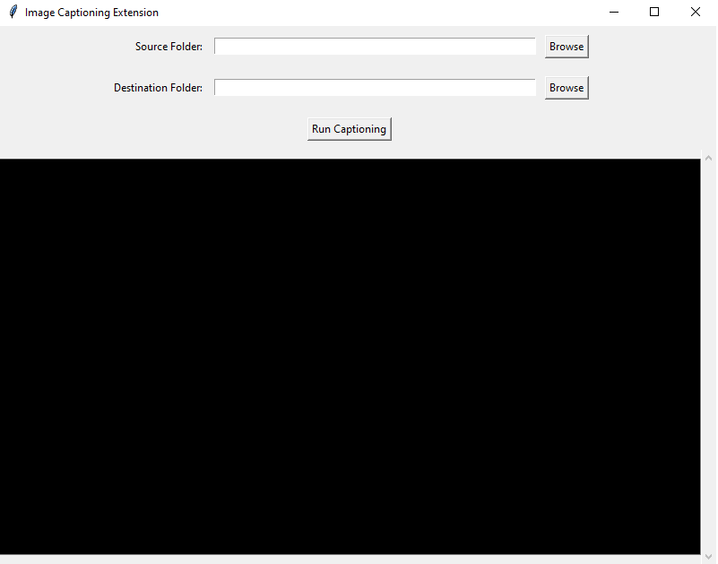

# Image-Captioning-Extension-for-LM-Studio

## Brief

This repository contains an unofficial extension for [LM Studio](https://lmstudio.ai) designed to automate the process of generating text captions for images. It allows users to utilize LM Studio's image text models like [llava](https://huggingface.co/jartine/llava-v1.5-7B-GGUF) to caption images automatically.


## Snapshot



## Workflow Explanation

The extension operates by reading a folder of images provided by the user. It sends requests to the LM Studio server for caption generation for each image in the folder. Upon receiving the captions from the server, it saves the generated captions into text files in a specified destination folder. The application incorporates a progress bar that becomes visible while the captioning process is ongoing. Additionally, it includes an embedded terminal that displays the status of processed files, indicating whether they were successful or encountered failures.

## Setup Instructions

### Using Python Virtual Environment

1. Create a Python virtual environment:
   ```bash
   python -m venv local
   ```
2. Install dependencies:
   ```bash
   .\local\Scripts\pip install openai==1.12.0
   ```
3. Run the tool:
   ```bash
   .\local\Scripts\python main.py
   ```

### Using Executables

1. Download the pre-built executable from the releases section.
2. Double-click the executable to run the tool.


## Notes

- Before using the extension, ensure that LM Studio is operating in server mode and that the image text model is loaded with the appropriate prompt template.
- Be sure to adjust the `config.ini` file to match your server settings. The default configuration is as follows:
  ```ini
  [OpenAI]
  base_url = http://localhost:1234/v1
  api_key = not-needed
  ```
- It's important to enable "Apply Prompt Formatting" in LM Studio because this formatting is not applied on the client side. Failure to do so may result in unexpected behavior and poor quality results.
- Supported image formats include PNG, JPEG, and JPG. Formats such as AVIF and WebP are not supported.

